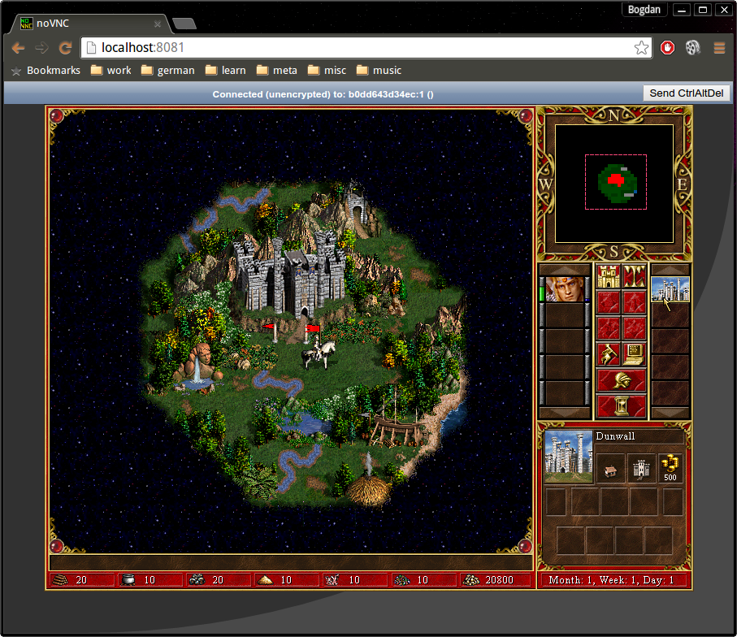

bmst/h3demo
===========

This is the Heroes3 Demo, made by 3DO, back in 1999. Available now as a docker image.
That you can play from the browser:



Running
-------

Running the game (means you agree with the [EULA](EULA)):

```shell
docker run \
    -e UID=$(id -u) \
    -e GID=$(id -g) \
    --rm \
    -p 8081:8081 \
    bmst/h3demo

docker build . -t heroes3 ; docker run -p 3000:3000 heroes3
```

Open a browser, point it at http://localhost:8081/

### Useful 

```powershell
# Add ignored file types to .gitignore
get-childitem .\Heroes3Demo\ -File -Recurse | % { "*$($_.Extension.tolower())" } | unique | Out-File -Append -Encoding utf8 -PSPath .gitignore 

## Add tracked files to LFS
get-childitem .\Heroes3Demo\ -File -Recurse | % { "*$($_.Extension.tolower()) filter=lfs diff=lfs merge=lfs -text" } | unique | Out-File -Append -Encoding utf8 -PSPath .gitattributes
```
